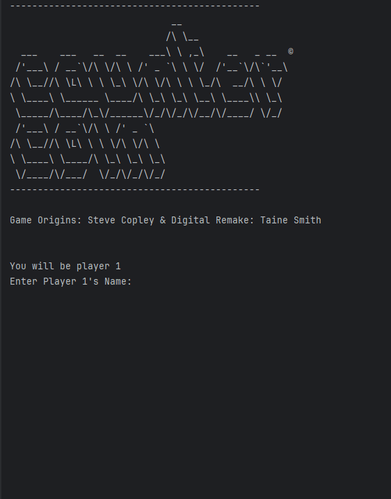
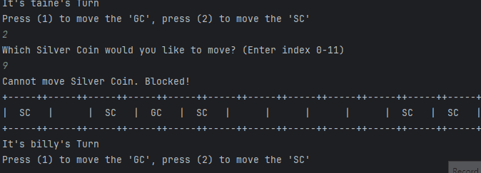

# Plan for Testing the Program

The test plan lays out the actions and data I will use to test the functionality of my program.

Terminology:

- **VALID** data values are those that the program expects
- **BOUNDARY** data values are at the limits of the valid range
- **INVALID** data values are those that the program should reject

---

## Testing the naming system

In the setup, you are required to pick a name for player 1 & for player 2

### Test Data To Use

By running the code

### Expected Test Result

 

---

## Testing the silver coins moving

### Test Data To Use

By running the code

### Expected Test Result

