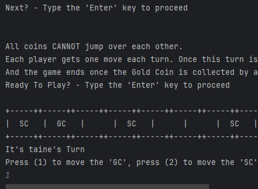

# Results of Testing

The test results show the actual outcome of the testing, following the [Test Plan](test-plan.md)

---

## Testing the naming system

### Test Data Used

By running my code, it will test it.

### Test Result

It worked as intended, it asked for the users player 1 name, the user inputs it, then it ask's for the player 2 username, and the user inputs it.

---

## Moving a silver and gold coin

Example test description. Example test description.Example test description. Example test description.Example test description. Example test description.

### Test Data Used

By playing the code, i'll test it

### Test Result

---

