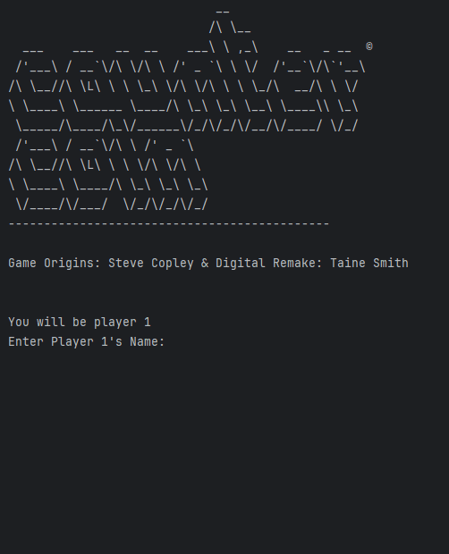

# Results of Testing

The test results show the actual outcome of the testing, following the [Test Plan](test-plan.md)

---

## Testing the naming system

Example test description. Example test description.Example test description. Example test description.Example test description. Example test description.

### Test Data Used

Details of test data. Details of test data. Details of test data. Details of test data. Details of test data. Details of test data. Details of test data.

### Test Result

It worked as intended, it asked for the users player 1 name, the user inputs it, then it ask's for the player 2 username, and the user inputs it.

---

## Example Test Name

Example test description. Example test description.Example test description. Example test description.Example test description. Example test description.

### Test Data Used

Details of test data. Details of test data. Details of test data. Details of test data. Details of test data. Details of test data. Details of test data.

### Test Result

Comment on test result. Comment on test result. Comment on test result. Comment on test result. Comment on test result. Comment on test result.

---

